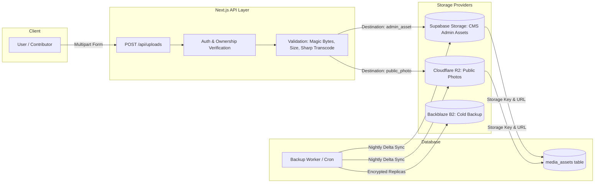

Listed directory eea
Viewed package.json:1-57
Ran command: `git status`
Viewed audit.md:1-200
Listed directory security
Viewed audit.md:201-502
Ran command: `npm run check`
Viewed rate-limit.ts:1-78
Used tool: manage_task
Viewed actions.ts:1-100
Viewed actions.ts:101-250
Used tool: manage_task
Listed directory migrations
Used tool: manage_task
Searched for "describe"
Used tool: manage_task
Used tool: manage_task
Viewed route.ts:1-117
Used tool: manage_task
Viewed upload.ts:1-95
Used tool: manage_task
Viewed 20260918000000_abuse_hardening.sql:1-143
Used tool: manage_task
Viewed next.config.ts:1-64
Used tool: manage_task
Searched for "reveal-contact"
Viewed page.tsx:1-100
Used tool: manage_task
Viewed reveal-contact.tsx:1-123
Used tool: manage_task
Viewed architecture-checklist.md:1-100
Used tool: manage_task
Viewed vitest.config.ts:1-13
Ran command: `npm test`
Used tool: manage_task
Used tool: manage_task
Viewed actions.ts:1-100
Viewed actions.ts:101-193
Viewed page.tsx:1-43
Viewed page.tsx:1-44

# Production-Readiness Master Audit & Engineering Roadmap

## Executive Summary & Architecture Verdict

The **Eagle Eye Africa (EEA)** platform has a solid foundational design: clean locale-first routing architecture via `proxy.ts`, structured custom i18n dictionaries (`en`/`fr`), typed role/capability models, and responsive UI components. 

However, **it is currently in an advanced prototype stage and not yet production-ready**. 

Recent updates have introduced initial abuse safeguards (`lib/security/rate-limit.ts`, `lib/security/turnstile.ts`, `lib/security/honeypot.ts`, and migration `20260918000000_abuse_hardening.sql`). However, critical vulnerabilities and architectural gaps remain across **data privacy, upload authorization, database RLS bypasses, missing core user workflows, caching/performance, and operational observability**.

```
┌──────────────────────────────────────────────────────────────────────────────────┐
│                             PRODUCTION READINESS SCORECARD                       │
├────────────────────────────┬─────────────┬───────────────────────────────────────┤
│ Pillar                     │ Status      │ Risk Assessment                       │
├────────────────────────────┼─────────────┼───────────────────────────────────────┤
│ 1. Security & Privacy      │ ⚠️ High Risk │ PII leakage in DOM & RLS grants;      │
│                            │             │ upload endpoint lacks item ownership. │
├────────────────────────────┼─────────────┼───────────────────────────────────────┤
│ 2. Data & RLS Architecture │ ⚠️ High Risk │ Service-role over-reliance bypasses   │
│                            │             │ RLS; raw profile tables exposed.      │
├────────────────────────────┼─────────────┼───────────────────────────────────────┤
│ 3. Feature Completeness    │ 🟡 Incomplete│ Marketplace posting & corrections     │
│                            │             │ routes are still <Placeholder />.     │
├────────────────────────────┼─────────────┼───────────────────────────────────────┤
│ 4. Performance & Caching   │ 🟡 Suboptimal│ Dynamic SSR across all public routes; │
│                            │             │ zero CDN edge caching / ISR tags.     │
├────────────────────────────┼─────────────┼───────────────────────────────────────┤
│ 5. Disaster Recovery & Ops │ ❌ Critical │ Backup runner not operational; no     │
│                            │             │ healthchecks, metrics, or alerts.     │
├────────────────────────────┼─────────────┼───────────────────────────────────────┤
│ 6. CI/CD & Deploy Gates    │ ❌ Critical │ No GitHub Actions, migration CI, or   │
│                            │             │ automated staging verification.       │
└────────────────────────────┴─────────────┴───────────────────────────────────────┘
```

---

## Part 1: Deep-Dive Audit Findings by Pillar

### Pillar 1: Security, Privacy & Abuse Controls

#### 1.1 Seller & Organizer Contact Privacy Leak (P0 - Critical)
* **Locations:** [components/buy-sell/reveal-contact.tsx](file:///c:/Users/VENTIZ/apps/eea/components/buy-sell/reveal-contact.tsx#L25-L39), [app/[locale]/(public)/buy-sell/[id]/page.tsx](file:///c:/Users/VENTIZ/apps/eea/app/[locale]/(public)/buy-sell/[id]/page.tsx#L66-L80), `lib/queries/fundraisers.ts`
* **Defect:** In [reveal-contact.tsx](file:///c:/Users/VENTIZ/apps/eea/components/buy-sell/reveal-contact.tsx#L27-L38), seller `contactPhone`, `contactEmail`, and `whatsappNumber` are fetched during Server-Side Rendering and embedded directly into the raw HTML/DOM. They are merely hidden using React state (`const [revealed, setRevealed] = useState(false)`). Scraping bots, web crawlers, and casual users inspecting page source can extract phone numbers and email addresses without restriction.
* **Remediation:**
  1. Strip private contact fields (`contact_phone`, `contact_email`, `whatsapp_number`) from public listing queries ([lib/queries/buy-sell.ts](file:///c:/Users/VENTIZ/apps/eea/lib/queries/buy-sell.ts)).
  2. Implement an authenticated/rate-limited Server Action (`revealSellerContact(listingId, method)`).
  3. Require either an authenticated session or an explicit CAPTCHA + verified email token for guest contact reveals. Log access events into `audit_logs` for anti-scraping anomaly detection.

#### 1.2 Unvalidated Parent Object Ownership in Upload Pipeline (P0 - Critical)
* **Locations:** [app/api/uploads/route.ts](file:///c:/Users/VENTIZ/apps/eea/app/api/uploads/route.ts#L43-L98), [lib/storage/upload.ts](file:///c:/Users/VENTIZ/apps/eea/lib/storage/upload.ts#L16-L42)
* **Defect:** While `admin_asset` now requires staff roles, `public_photo` allows *any* authenticated user to supply an arbitrary `contentItemId`. The API does not verify whether the caller owns the target `contentItemId` or whether that record is in a writable state (`draft`/`pending`). Furthermore, files uploaded directly to Cloudflare R2 do not create an associated `media_assets` database record transactionally, resulting in untracked and orphaned storage objects.
* **Remediation:**
  ```mermaid
  sequenceDiagram
      autonumber
      actor User as Authenticated User
      participant Route as POST /api/uploads
      participant DB as Supabase DB
      participant Storage as Cloudflare R2 / S3
      
      User->>Route: Upload payload (file, destination, contentItemId)
      Route->>Route: Validate mime, magic bytes, dimensions (Sharp)
      Route->>DB: Verify user owns contentItemId & status in ('draft','pending')
      alt Unauthorized / Not Owner
          DB-->>Route: Forbidden (403)
          Route-->>User: 403 Access Denied
      else Authorized
          Route->>Storage: Stream sanitized file
          Storage-->>Route: Storage URL / Key
          Route->>DB: INSERT into media_assets (transactional)
          DB-->>Route: media_asset_id
          Route-->>User: 201 Created (media asset object)
      end
  ```

#### 1.3 Missing Security Headers & CSP (P1 - High)
* **Location:** [next.config.ts](file:///c:/Users/VENTIZ/apps/eea/next.config.ts#L35-L49)
* **Defect:** `next.config.ts` defines basic headers (`X-Content-Type-Options`, `X-Frame-Options`, `Referrer-Policy`, `Permissions-Policy`), but lacks:
  - `Content-Security-Policy` (CSP)
  - `Strict-Transport-Security` (HSTS)
  - `Cross-Origin-Opener-Policy` (COOP)
  - `Cross-Origin-Resource-Policy` (CORP)
* **Remediation:** Configure a strict CSP policy that allows scripts and styles only from self, Cloudflare Turnstile (`challenges.cloudflare.com`), Supabase auth callbacks, and configured media CDNs (R2/Supabase Storage/Cloudinary).

---

### Pillar 2: Database, RLS & Data Integrity

#### 2.1 Service-Role Bypass vs. Native Row Level Security (P0 - Critical)
* **Locations:** [lib/public/actions.ts](file:///c:/Users/VENTIZ/apps/eea/lib/public/actions.ts#L127-L146), `lib/admin/actions.ts`, [supabase/migrations/20260901000000_init_schema.sql](file:///c:/Users/VENTIZ/apps/eea/supabase/migrations/20260901000000_init_schema.sql#L913-L945)
* **Defect:** Because anonymous writes and public forms use `createAdminClient()` (`service_role`), all database-level RLS policies and table permissions are completely bypassed. If a developer forgets an application-level constraint in a Server Action, unconstrained writes hit the database.
* **Remediation:**
  1. For public guest forms (`submissions`, `data_requests`, `advertisers`), define explicit, constrained Postgres RLS `INSERT` policies that validate required payload formats at the database engine level (e.g. `WITH CHECK (status = 'pending' AND guest_name IS NOT NULL)`).
  2. Implement safe public views (e.g., `create view public.public_profiles as select id, display_name, avatar_url, bio from public.profiles;`) and revoke `SELECT` on `public.profiles` from `anon`.

#### 2.2 Inconsistent Public Visibility & Archival Predicates (P1 - High)
* **Locations:** [lib/queries/buy-sell.ts](file:///c:/Users/VENTIZ/apps/eea/lib/queries/buy-sell.ts), `lib/queries/news.ts`, `lib/queries/notices.ts`
* **Defect:** Different query modules use disparate filtering logic for what constitutes "published" content:
  - News queries check `status = 'published'` and `published_at <= now()`.
  - Marketplace queries check `listing_status = 'active'`.
  - Notice queries check `status = 'published'` but omit checking `is_archived = false` or `expires_at > now()`.
* **Remediation:** Create standard database views (`view_published_news`, `view_active_listings`, `view_active_notices`) or a canonical query helper function that encapsulates all lifecycle constraints uniformly.

---

### Pillar 3: Product Completeness & User Workflows

#### 3.1 Unimplemented Critical Workflows (P1 - High)
* **Locations:**
  - [app/[locale]/(focused)/buy-sell/post/page.tsx](file:///c:/Users/VENTIZ/apps/eea/app/[locale]/(focused)/buy-sell/post/page.tsx#L6-L42)
  - [app/[locale]/(focused)/news/[slug]/correction/page.tsx](file:///c:/Users/VENTIZ/apps/eea/app/[locale]/(focused)/news/[slug]/correction/page.tsx#L6-L43)
* **Defect:** These two core routes display a static `<Placeholder />` component. Users clicking "Post a Listing" or "Submit a Correction" on any news article hit a dead end.
* **Remediation:**
  1. **Buy/Sell Post Flow:** Build a multi-step form with category selection, pricing/currency rules, location tagging, photo upload (via the hardened upload endpoint), contact preferences, and moderation status submission.
  2. **Article Correction Flow:** Build a dedicated form that pre-populates the target article reference, collects specific claim timestamps/paragraphs, correction rationale, source URLs, and feeds directly into the admin editorial triage queue.

#### 3.2 Sitemap Route Desynchronization (P1 - High)
* **Location:** `app/sitemap.ts`
* **Defect:** Sitemap generates URLs for `/submit/notices` (plural), but the actual route implemented in the App Router is [app/[locale]/(focused)/submit/notice/page.tsx](file:///c:/Users/VENTIZ/apps/eea/app/[locale]/(focused)/submit/notice/page.tsx) (singular). In addition, dynamic sitemap generation includes archived/expired items.
* **Remediation:** Update `sitemap.ts` route definitions and add an automated route validation test (`scripts/verify-sitemap.mjs`) in CI that checks every URL in the generated sitemap against Next.js route manifest.

---

### Pillar 4: Performance, Caching & Scalability

#### 4.1 Uncached Dynamic SSR on Public Traffic (P1 - High)
* **Locations:** [proxy.ts](file:///c:/Users/VENTIZ/apps/eea/proxy.ts#L1-L85), [app/[locale]/(public)/page.tsx](file:///c:/Users/VENTIZ/apps/eea/app/[locale]/(public)/page.tsx), `app/[locale]/(public)/news/[slug]/page.tsx`
* **Defect:** Calling `headers()` and `cookies()` at the page root triggers dynamic SSR on every visitor request. During traffic spikes (breaking news, viral stories), every single page view executes full database queries through Supabase instead of serving pre-rendered static HTML from edge CDN caches.
* **Remediation:**
  - Decouple public content pages from dynamic header lookups where possible.
  - Implement Next.js Incremental Static Regeneration (ISR) with cache tags (`revalidateTag('news')`, `revalidateTag('taxonomy')`) and revalidate on editorial publication.
  - Pass locale as a URL parameter rather than inspecting dynamic request headers inside static page components.

---

### Pillar 5: Operations, Reliability & Disaster Recovery

#### 5.1 Non-Operational Storage Backup Pipeline (P1 - High)
* **Locations:** `lib/storage/backup.ts`, [app/[locale]/(app)/admin/storage-backup/page.tsx](file:///c:/Users/VENTIZ/apps/eea/app/[locale]/(app)/admin/storage-backup/page.tsx)
* **Defect:** The admin interface allows triggering backups, but `triggerBackup()` merely writes a status flag (`backup_status = 'pending'`). There is no active cron task, background worker (e.g. Inngest, Cloudflare Worker, or pg_cron), or queue consumer that performs the actual multi-part copy from R2/Supabase to Backblaze B2, nor is there any automated backup verification routine.
* **Remediation:**
  - Implement a secured cron route (`/api/cron/storage-backup`) with a bearer token header (`CRON_SECRET`).
  - Implement lease/lock semantics in Postgres to prevent concurrent backup execution.
  - Add SHA-256 checksum verification between source and destination storage objects.

#### 5.2 Silent Failures & Lack of Structured Observability (P1 - High)
* **Locations:** All query modules (`lib/queries/*.ts`, `lib/public/actions.ts`)
* **Defect:** Database and network errors are caught and logged with plain `console.error`, followed by returning an empty array `[]` or generic fallback. A database outage or schema migration failure is masked as "no articles found" with HTTP 200 responses.
* **Remediation:**
  - Introduce structured JSON logging (correlation ID, user ID, client IP, execution duration).
  - Integrate an error reporting provider (Sentry or OpenTelemetry).
  - Add `/api/health` (liveness: process up) and `/api/ready` (readiness: Supabase ping, R2 ping) endpoints for uptime monitors and deployment healthchecks.

---

### Pillar 6: CI/CD & Deployment Rigor

#### 6.1 Missing Automated CI Pipeline (P1 - High)
* **Location:** `.github/workflows/` (currently empty)
* **Defect:** All tests, type checks, lint checks, and bare-href scans exist only as manual local npm scripts. There is no automated gate blocking broken code from landing on `main`.
* **Remediation:** Create a GitHub Actions workflow (`.github/workflows/ci.yml`) running:
  - `npm run check` (TypeScript + ESLint + `scripts/find-bare-hrefs.mjs`)
  - `npm test` (Vitest suite)
  - `npm run build` (Next.js production build dry-run)
  - Supabase migration linter (`supabase db lint`)

---

## Part 2: Architectural Defense & Processing Blueprints

### 1. Multi-Tier Public Form & Abuse Defense Pipeline

```mermaid
graph TD
    A[Public Form Submission] --> B{1. Honeypot Field Tripped?}
    B -- Yes --> C[Return Fake 200 OK - Drop Payload]
    B -- No --> D{2. Cloudflare Turnstile Token Valid?}
    D -- No --> E[Return 400 CAPTCHA Failed]
    D -- Yes --> F{3. Postgres Distributed Rate Limit Exceeded?}
    F -- Yes --> G[Return 429 Too Many Requests]
    F -- No --> H{4. Zod Schema Validation Passed?}
    H -- No --> I[Return 422 Invalid Input Fields]
    H -- Yes --> J{5. Duplicate Submission Check?}
    J -- Duplicate --> K[Return 409 Conflict / Already Submitted]
    J -- Clean --> L[Atomic Insert into submissions Table (status: 'pending')]
    L --> M[Log Action in audit_logs]
    M --> N[Return 201 Success]
```

### 2. Media Upload & Asset Storage Architecture



---

## Part 3: Prioritized Production Remediation Plan

```
┌────────────────────────────────────────────────────────────────────────┐
│                        PHASED EXECUTION ROADMAP                        │
└────────────────────────────────────────────────────────────────────────┘
  │
  ├── PHASE 1: Security, PII Leakage & Upload Hardening (Immediate P0)
  │   ├── 1.1 Remove contact PII from server-rendered listing HTML
  │   ├── 1.2 Implement server-side rate-limited contact reveal action
  │   ├── 1.3 Add ownership validation to POST /api/uploads
  │   ├── 1.4 Secure public profile database grants with safe views
  │   └── 1.5 Add CSP, HSTS, COOP, and CORP headers in next.config.ts
  │
  ├── PHASE 2: Complete Missing Workflows & Sitemap Fixes (P1)
  │   ├── 2.1 Build Buy/Sell listing creation wizard (/buy-sell/post)
  │   ├── 2.2 Build article correction submission workflow (/news/[slug]/correction)
  │   ├── 2.3 Fix /submit/notice route synchronization in sitemap.ts
  │   └── 2.4 Unify published/archived content filtering across all queries
  │
  ├── PHASE 3: Operational Resilience, Backup & Observability (P1)
  │   ├── 3.1 Implement scheduled worker for R2/Supabase -> B2 cold backup
  │   ├── 3.2 Add backup integrity verification & restore test script
  │   ├── 3.3 Add /api/health and /api/ready observability endpoints
  │   └── 3.4 Replace raw console.error with structured logging & error tracking
  │
  ├── PHASE 4: Performance, Caching & Database Hardening (P2)
  │   ├── 4.1 Enable ISR & cache-tag revalidation for high-traffic public news
  │   ├── 4.2 Add automated DB migration verification & vacuum for rate_limit_hits
  │   └── 4.3 Add database constraints on submission payload structures
  │
  └── PHASE 5: CI/CD Pipeline & Two-Locale Sign-Off (P2)
      ├── 5.1 Create GitHub Actions CI workflow (lint, typecheck, test, build)
      ├── 5.2 Run automated bare-href and sitemap route verification in CI
      └── 5.3 Complete edge-case matrix validation across EN and FR locales
```

---

## Next Steps

We can proceed to execute this plan systematically starting with **Phase 1: Security, PII Leakage & Upload Hardening**. Let me know if you would like to begin with Phase 1 immediately or adjust any priorities!